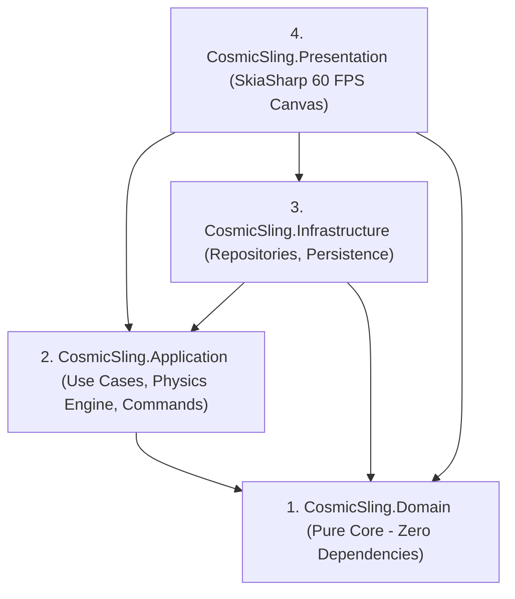

# 🚀 Cosmic Sling

[](https://dotnet.microsoft.com/)
[](https://github.com/mono/SkiaSharp)
[](https://blog.cleancoder.com/uncle-bob/2012/08/13/the-clean-architecture.html)
[](https://deepmind.google/)

**Cosmic Sling** is a lightweight, physics-based 2D gravity slingshot puzzle game built from scratch in **C# (.NET 10)** using **Clean Architecture**, strictly adhering to **SOLID principles** and industry-standard **Design Patterns**.

> ✨ **Developed collaboratively with AI** using advanced pair-programming to showcase how a rich, 60 FPS 2D game engine can be cleanly decoupled across Domain, Application, Infrastructure, and Presentation layers without sacrificing performance or visual polish.

<p align="center">
  
</p>

---

## 🎮 Gameplay & Mechanics

In **Cosmic Sling**, you pilot a neon spacecraft navigating deep space puzzle arenas dominated by celestial gravity wells.

### 🌌 How to Play
1. **Aim the Slingshot:** Click and hold near your spaceship, then **drag backwards** (like a slingshot) to set your launch angle and power.
2. **Predict the Trajectory:** As you drag, the onboard computer projects a **dotted yellow trajectory line** simulating up to 45 physics steps ahead, showing how nearby planets will bend your path.
3. **Launch & Slingshot:** Release the mouse button to fire your spacecraft! Use **gravitational slingshot maneuvers** around planets to curve your flight path around deadly obstacles.
4. **Reach the Portal:** Navigate your spaceship safely into the glowing **green target portal** to complete the level!

### 🪐 Celestial Entities & Hazards
- **Blue & Purple Planets (Newtonian Gravity):** Exert standard inverse-square gravitational pull ($F = G \frac{m_1 m_2}{r^2}$) toward their core.
- **Orange Repulsors (Anti-Gravity Fields):** Actively push your spaceship away from their center.
- **Pink Black Holes:** Intense gravitational attractors that require careful momentum balance.
- **Asteroid Obstacles & Dead Zones:** Touching any obstacle or planet core results in instant ship destruction.

---

## ⌨️ Controls

| Input / Key | Action |
| :--- | :--- |
| **Left Mouse Drag & Release** | Aim slingshot, view predicted trajectory, and launch spaceship |
| **`R`** | Reset current level / restart attempt |
| **`Z`** | **Undo last launch** (Command Pattern replay/rollback) |
| **`1`, `2`, `3`** | Switch instantly between **Level 1**, **Level 2**, and **Level 3** |

---

## 🏛️ Clean Architecture & Design Patterns

The codebase is structured into **4 decoupled layers** with zero circular dependencies:



### Key Design Patterns Implemented
- **Strategy Pattern (`IPhysicsStrategy`):** Decouples force calculations (`NewtonianGravityStrategy`, `RepulsionFieldStrategy`), allowing new gravitational or magnetic fields to be added Open/Closed Principle compliant.
- **Command Pattern (`IGameCommand`):** Encapsulates player actions (`LaunchShipCommand`) with full `Execute()` and `Undo()` support.
- **Observer Pattern (`IGameEventListener`):** Event-driven notifications for level completion, ship launches, and collisions.
- **Factory Method (`LevelFactory`):** Encapsulates level creation and entity layout for multi-stage progression.
- **State Pattern (`GameSessionService`):** Manages transitions across `Aiming`, `Flying`, `LevelCompleted`, and `GameOver`.

---

## 🛠️ Tech Stack & Requirements

- **Runtime / SDK:** [.NET 10.0 SDK](https://dotnet.microsoft.com/) (`net10.0` / `net10.0-windows`)
- **Rendering Engine:** [SkiaSharp](https://github.com/mono/SkiaSharp) v4.150.0 (MIT Licensed 2D Vector Graphics)
- **Testing Framework:** [xUnit](https://xunit.net/)

---

## 🚀 Building & Running

### Run the Game
Open a terminal in the repository root and launch the SkiaSharp presentation window:
```powershell
dotnet run --project src/CosmicSling.Presentation
```

### Run Automated Unit Tests
Verify all physics vector math, gravitational strategies, command undo/redo, and collision detection tests:
```powershell
dotnet test
```

---

## 📄 License
This demo project is released under the **MIT License**.